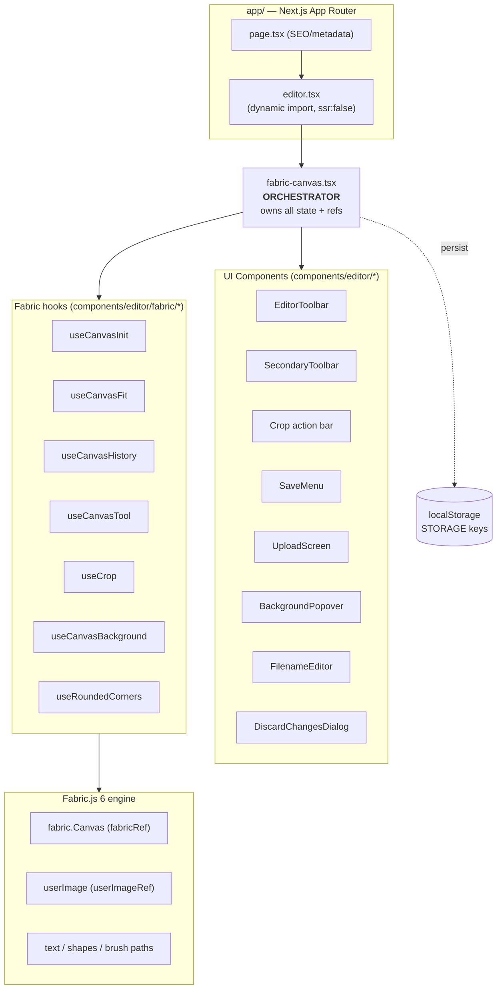
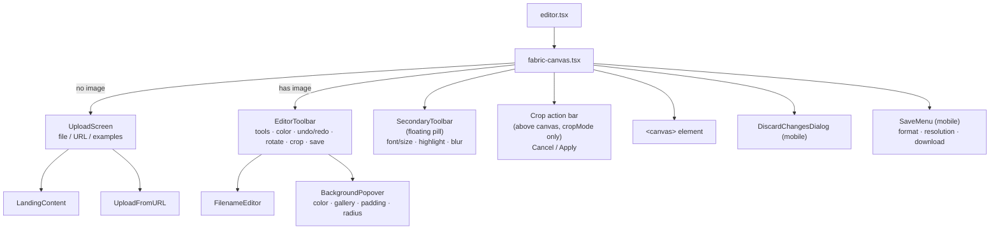
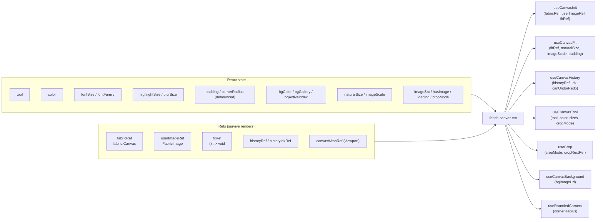
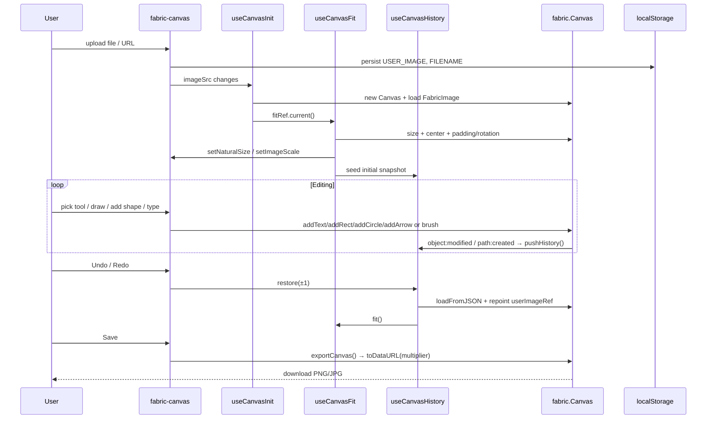

# Image Editor — Architecture

A client-side image editor built on **Next.js 16 (App Router) + React 19** with **Fabric.js 6** as the canvas engine. It's effectively a single-page app: `app/page.tsx` renders one `<Editor />`, and **`fabric-canvas.tsx` is the orchestrator** that owns all state and wires together a layer of focused Fabric hooks. Persistence is entirely `localStorage` — no backend.

---

## 1. High-level layers

---

## 2. Component tree

> Note: the tree is intentionally **shallow** — one canvas plus a handful of overlay/toolbar children. Complexity lives in the hooks layer, not in nesting.

---

## 3. State + refs wiring (the orchestrator)

`fabric-canvas.tsx` holds the single source of truth and passes slices into each hook.

### Hook responsibilities

| Hook | Responsibility | Key refs/state |
|---|---|---|
| `useCanvasInit` | Create `fabric.Canvas`, load image, attach `path:created`/`object:modified` → `pushHistory` | `fabricRef`, `userImageRef`, sets `fitRef` consumer |
| `useCanvasFit` | Size canvas to viewport, center image, apply padding/rotation; **provides `fit()`** | `fitRef` (setter), `setNaturalSize`, `setImageScale` |
| `useCanvasHistory` | Undo/redo via JSON snapshots; restore = `loadFromJSON` + repoint `userImageRef` + refit | `historyRef`, `historyIdxRef`, `canUndo/canRedo` |
| `useCanvasTool` | Switch drawing mode: pen / highlight / blur / select; disabled in crop | `fabricRef`, `tool`, `color`, sizes, `cropMode` |
| `useCrop` | Enter/cancel/apply crop; inset rect with custom handles; apply mutates `img.cropX/Y/W/H` | `cropRectRef`, `cropMode` |
| `useCanvasBackground` | Load bg image → `canvas.backgroundImage` → `fit()` (cover math) | `bgImageUrl`, `fitRef` |
| `useRoundedCorners` | `clipPath` rounded rect on `userImageRef` | `cornerRadius` |

---

## 4. Data flow — upload → edit → export

---

## 5. Persistence (localStorage via `lib/utils.ts` → `STORAGE`)

| Key | Holds | Written |
|---|---|---|
| `editor.userImage` | image data-URL (≤ 4 MB) | on upload |
| `editor.filename` | export filename | on rename |
| `editor.bgColor` | canvas background hex | debounced |
| `editor.padding` / `editor.cornerRadius` | frame sliders | debounced |
| `editor.bgGallery` | JSON array of bg data-URLs | on add/remove |
| `editor.bgActiveIndex` | active gallery item | on select |

Guards: `MAX_PERSISTED_IMAGE_BYTES = 4MB`, `MAX_W/MAX_H = 4000px`, `safeSet()` swallows quota errors.

---

## 6. Key mechanics worth knowing

- **CSS-downscale rendering**: backstore renders at native resolution; the `<canvas>` element is CSS-shrunk to fit. `cssScaleOf()` converts screen-px sizes → canvas-px so handles/strokes/fonts stay a constant on-screen size at any image resolution.
- **History = JSON snapshots**: `toObject([...])` strings pushed to `historyRef`; `loadFromJSON` rebuilds **new** object instances, so restore must repoint `userImageRef` and refit.
- **`fitRef` indirection**: `useCanvasFit` writes `fit()` into `fitRef` so other hooks (history, crop, background, rotate) can re-fit without import cycles.
- **Font cap**: corner-resizing text clamps **scale** (not `fontSize`) to keep box + glyphs in lockstep, bounded by `MIN_FONT`/`MAX_FONT`.

---

## 7. Tech stack

`fabric@6.9.1` · `next@16.2.6` · `react@19.2` · `@radix-ui` + `shadcn` UI · `lucide-react` icons · `tailwindcss@4` · `sonner` toasts · `vitest` tests.
